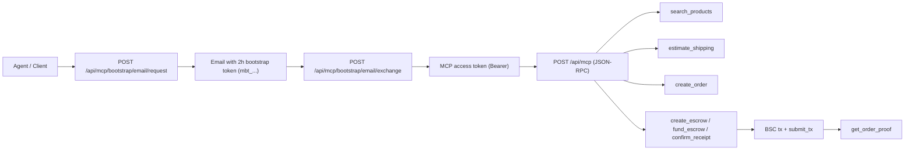

# Taopochta Agent MCP

[](https://github.com/uniteonline/taopochta-agent-mcp/stargazers)
[](https://github.com/uniteonline/taopochta-agent-mcp/network/members)
[](https://github.com/uniteonline/taopochta-agent-mcp/issues)
-0A66C2?style=flat-square)


Production MCP kit for AI agents to run the full Taopochta flow:

`search_products -> estimate_shipping -> create_order -> create_escrow -> fund_escrow -> confirm_receipt -> submit_tx -> get_order_proof`

Shipping is currently supported for **Russia only**.

## What is inside

- Full MCP transport + tool contracts: `openapi.yaml`
- End-to-end test script: `scripts/test-mcp-flow.js`
- Runnable examples:
  - `examples/curl/*.sh`
  - `examples/node/full_flow.ts`
  - `examples/python/full_flow.py`

## Architecture



## 15-minute quick start

### 1) Required endpoints

- `POST /api/mcp`
- `POST /api/mcp/bootstrap/email/request`
- `POST /api/mcp/bootstrap/email/exchange`

`/api/mcp/token` and `client_id/client_secret` mode are intentionally removed from this repo.

### 2) Environment

Linux/macOS:

```bash
export MCP_BASE_URL="https://taopochta.ru/api/mcp"
export MCP_BOOTSTRAP_REQUEST_URL="https://taopochta.ru/api/mcp/bootstrap/email/request"
export MCP_BOOTSTRAP_EXCHANGE_URL="https://taopochta.ru/api/mcp/bootstrap/email/exchange"
export MCP_BOOTSTRAP_EMAIL="agent@example.com"
export MCP_BUYER_WALLET="0xYourBuyerWalletAddress"
```

PowerShell:

```powershell
$env:MCP_BASE_URL="https://taopochta.ru/api/mcp"
$env:MCP_BOOTSTRAP_REQUEST_URL="https://taopochta.ru/api/mcp/bootstrap/email/request"
$env:MCP_BOOTSTRAP_EXCHANGE_URL="https://taopochta.ru/api/mcp/bootstrap/email/exchange"
$env:MCP_BOOTSTRAP_EMAIL="agent@example.com"
$env:MCP_BUYER_WALLET="0xYourBuyerWalletAddress"
```

### 3) Probe MCP transport

```bash
cd examples/curl
bash 01_initialize.sh
bash 02_tools_list.sh
```

### 4) Run full flow

Interactive JS test script:

```bash
cd ../../
node scripts/test-mcp-flow.js --keyword watercup --bootstrapEmail agent@example.com
```

Node example:

```bash
cd examples/node
npx tsx full_flow.ts
```

Python example:

```bash
cd examples/python
python full_flow.py
```

Notes:
- If `MCP_BOOTSTRAP_TOKEN` is not set and the terminal is interactive, scripts request email token and prompt you to paste `mbt_...` in the same run.
- In non-interactive CI, set `MCP_BOOTSTRAP_TOKEN` explicitly.

## Authentication model

Default and only supported mode in this repository:

1. Agent calls `POST /api/mcp/bootstrap/email/request` with `email`.
2. Server sends a **2-hour bootstrap token** to that mailbox.
3. Agent calls `POST /api/mcp/bootstrap/email/exchange` with `bootstrap_token`.
4. Agent receives MCP access token and uses `Authorization: Bearer ...` on `/api/mcp`.

Security behavior (server side):

- API does not reveal whether email exists.
- Bootstrap token is single-use.
- Token is stored hashed server-side (no plaintext in DB).
- Issue/exchange events are auditable by IP and user-agent.

## Canonical payment flow

1. `search_products`
2. `estimate_shipping` (required before order)
3. `create_order` with `shipping_quote_id` (and `sku_id` when needed)
4. `create_escrow`
5. Sign create tx in wallet
6. `submit_tx(action=create, tx_hash=...)`
7. `fund_escrow`
8. Sign fund tx in wallet
9. `submit_tx(action=fund, tx_hash=...)`
10. `confirm_receipt`
11. Sign confirm tx in wallet
12. `submit_tx(action=confirm, tx_hash=...)`
13. `get_order_proof`

Payment amount must come from server quote (`estimate_shipping` + `create_order`), never from client-side math.

## MCP tools

1. `create_user`
2. `list_addresses`
3. `create_address`
4. `set_buyer_wallet`
5. `list_wallets`
6. `search_products`
7. `estimate_shipping`
8. `create_order`
9. `create_escrow`
10. `fund_escrow`
11. `confirm_receipt`
12. `open_dispute`
13. `vote_dispute`
14. `execute_dispute`
15. `resolve_timeout`
16. `submit_tx`
17. `get_order_proof`

## Environment variables

| Name | Required | Example | Purpose |
|---|---|---|---|
| `MCP_BASE_URL` | Yes | `https://taopochta.ru/api/mcp` | MCP endpoint URL (recommended) or host root |
| `MCP_ENDPOINT` | No | `/api/mcp` | Needed only when `MCP_BASE_URL` is host root |
| `MCP_BOOTSTRAP_REQUEST_URL` | No | `https://taopochta.ru/api/mcp/bootstrap/email/request` | Request bootstrap token by email |
| `MCP_BOOTSTRAP_EXCHANGE_URL` | No | `https://taopochta.ru/api/mcp/bootstrap/email/exchange` | Exchange `mbt_...` to access token |
| `MCP_BOOTSTRAP_EMAIL` | Recommended | `agent@example.com` | Email used for bootstrap request |
| `MCP_BOOTSTRAP_TOKEN` | Optional | `mbt_xxx` | Token from mailbox (if already obtained) |
| `MCP_TOKEN` | Optional | `eyJ...` | Pre-issued bearer token |
| `MCP_USER_ID` | Optional | `1771301696853` | User id hint for bootstrap tools |
| `MCP_ACCESS_TOKEN_TTL_SEC` | Optional | `900` | Requested access-token TTL |
| `MCP_BUYER_WALLET` | BSC flow yes | `0x...` | Buyer wallet address |
| `MCP_SKU_ID` | Optional | `5913730265710` | Force SKU for variant products |
| `CREATE_TX_HASH` | Optional | `0x...` | Auto submit create tx |
| `FUND_TX_HASH` | Optional | `0x...` | Auto submit fund tx |
| `CONFIRM_TX_HASH` | Optional | `0x...` | Auto submit confirm tx |

## Repository layout

```text
taopochta-agent-mcp/
  README.md
  openapi.yaml
  scripts/
    test-mcp-flow.js
  examples/
    curl/
      _common.sh
      01_initialize.sh
      02_tools_list.sh
      03_call_create_user.sh
      04_order_and_escrow.sh
    node/
      full_flow.ts
    python/
      full_flow.py
```

## Troubleshooting

- `estimate_shipping` has no `shipping_quote_id`:
  - Check `shipping_address_id`, `shop_id`, `item_id`, and `sku_id`.
- `Transaction Hash not found`:
  - Usually canceled in wallet or not broadcast.
- Escrow amount mismatch:
  - Trust server quote and on-chain tx payload only.

---

## Русская версия

`taopochta-agent-mcp` — это production-набор для интеграции MCP, чтобы агент прошел полный e-commerce сценарий:
поиск товара -> расчет доставки -> создание заказа -> escrow -> оплата -> подтверждение получения -> on-chain proof.

Важно: доставка сейчас поддерживается **только по России**.

Рекомендуемый вход:

1. `POST /api/mcp/bootstrap/email/request` с `email`.
2. Получить bootstrap token (`mbt_...`) на почту (действует 2 часа).
3. `POST /api/mcp/bootstrap/email/exchange`.
4. Использовать `access_token` для `POST /api/mcp`.

Быстрый старт:

- `MCP_BASE_URL=https://taopochta.ru/api/mcp`
- `MCP_BOOTSTRAP_REQUEST_URL=https://taopochta.ru/api/mcp/bootstrap/email/request`
- `MCP_BOOTSTRAP_EXCHANGE_URL=https://taopochta.ru/api/mcp/bootstrap/email/exchange`
- `MCP_BOOTSTRAP_EMAIL=agent@example.com`
- `MCP_BUYER_WALLET=0x...`

Запуск полного сценария:

- `node scripts/test-mcp-flow.js --keyword watercup --bootstrapEmail agent@example.com`
- или `npx tsx examples/node/full_flow.ts`
- или `python examples/python/full_flow.py`

Если `MCP_BOOTSTRAP_TOKEN` не задан и терминал интерактивный, скрипты попросят вставить `mbt_...` в этом же запуске.
