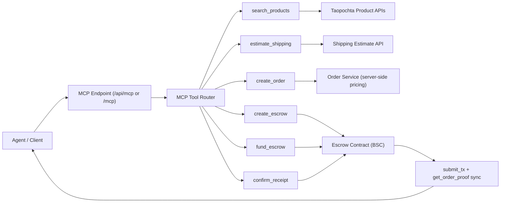

# Taopochta Agent MCP

[](https://github.com/uniteonline/taopochta-agent-mcp/stargazers)
[](https://github.com/uniteonline/taopochta-agent-mcp/network/members)
[](https://github.com/uniteonline/taopochta-agent-mcp/issues)
-0A66C2?style=flat-square)


Production-ready MCP integration kit for AI agents to run the full Taopochta flow:

`search_products -> estimate_shipping -> create_order -> create_escrow -> fund_escrow -> confirm_receipt -> submit_tx -> get_order_proof`

## Important

Shipping is currently supported for **Russia only**.

## What Is Included

- MCP API spec: `openapi.yaml`
- End-to-end JS test script: `scripts/test-mcp-flow.js`
- Runnable examples:
  - `examples/curl/*.sh`
  - `examples/node/full_flow.ts`
  - `examples/python/full_flow.py`

## Architecture



## 15-Minute Quick Start

### 1) Server prerequisites

Your API service should expose:

- `POST /api/mcp`
- `POST /api/mcp/rpc` (optional alias)
- `POST /api/mcp/token` (issue access token)
- `POST /api/mcp/token/revoke` (revoke refresh token)

### 2) Environment (recommended)

Use direct MCP endpoint URL as default:

```bash
export MCP_BASE_URL="https://taopochta.ru/api/mcp"
export MCP_TOKEN_URL="https://taopochta.ru/api/mcp/token"
export MCP_CLIENT_ID="your_agent_client_id"
export MCP_CLIENT_SECRET="your_agent_client_secret"
export MCP_USER_ID="$(date +%s)"
export MCP_BUYER_WALLET="0xYourBuyerWalletAddress"
```

If your deployment uses root host + endpoint path:

```bash
export MCP_BASE_URL="https://taopochta.ru"
export MCP_ENDPOINT="/api/mcp"
```

If you already have bearer token:

```bash
export MCP_TOKEN="eyJ..."
```

PowerShell:

```powershell
$env:MCP_BASE_URL="https://taopochta.ru/api/mcp"
$env:MCP_TOKEN_URL="https://taopochta.ru/api/mcp/token"
$env:MCP_CLIENT_ID="your_agent_client_id"
$env:MCP_CLIENT_SECRET="your_agent_client_secret"
$env:MCP_USER_ID=[int][double]::Parse((Get-Date -UFormat %s))
$env:MCP_BUYER_WALLET="0xYourBuyerWalletAddress"
```

### 3) Probe MCP

```bash
cd examples/curl
bash 01_initialize.sh
bash 02_tools_list.sh
```

### 4) Run full flow

Interactive JS (manual wallet signing):

```bash
cd ../../
node scripts/test-mcp-flow.js --keyword watercup
```

TypeScript:

```bash
cd examples/node
npx tsx full_flow.ts
```

Python:

```bash
cd examples/python
python full_flow.py
```

## Canonical Payment Flow

1. `search_products`
2. `estimate_shipping` (must happen before order)
3. `create_order` with `shipping_quote_id` (and `sku_id` when applicable)
4. `create_escrow`
5. Sign create tx in wallet
6. `submit_tx(action=create, tx_hash=...)`
7. `fund_escrow`
8. Sign fund tx in wallet
9. `submit_tx(action=fund, tx_hash=...)`
10. `confirm_receipt`
11. Sign confirm tx in wallet
12. `submit_tx(action=confirm, tx_hash=...)`
13. `get_order_proof`

Security rule: payment amount must come from server-side quote (`create_order` / escrow payload), not client-side arithmetic.

## Available MCP Tools

1. `create_user`
2. `list_addresses`
3. `create_address`
4. `set_buyer_wallet`
5. `list_wallets`
6. `search_products`
7. `estimate_shipping`
8. `create_order`
9. `create_escrow`
10. `fund_escrow`
11. `confirm_receipt`
12. `open_dispute`
13. `vote_dispute`
14. `execute_dispute`
15. `resolve_timeout`
16. `submit_tx`
17. `get_order_proof`

## Environment Variables

| Name | Required | Example | Purpose |
|---|---|---|---|
| `MCP_BASE_URL` | Yes | `https://taopochta.ru/api/mcp` | MCP endpoint URL (recommended) or host root |
| `MCP_ENDPOINT` | No | `/api/mcp` | Needed only when `MCP_BASE_URL` is host root |
| `MCP_TOKEN_URL` | No | `https://taopochta.ru/api/mcp/token` | Token issue endpoint |
| `MCP_CLIENT_ID` | Yes* | `agent_demo` | OAuth client id |
| `MCP_CLIENT_SECRET` | Yes* | `replace_me` | OAuth client secret |
| `MCP_TOKEN` | Optional | `eyJ...` | Pre-issued bearer token (skip token issue call) |
| `MCP_USER_ID` | Optional | `1771301696853` | `sub` claim used for token issuing |
| `MCP_ACCESS_TOKEN_TTL_SEC` | Optional | `900` | Requested access-token TTL |
| `MCP_REFRESH_TOKEN_TTL_SEC` | Optional | `2592000` | Requested refresh-token TTL |
| `MCP_BUYER_WALLET` | BSC flow yes | `0x...` | Buyer wallet address |
| `MCP_SKU_ID` | Optional | `5913730265710` | Force SKU for variant products |
| `CREATE_TX_HASH` | Optional | `0x...` | Auto submit create tx |
| `FUND_TX_HASH` | Optional | `0x...` | Auto submit fund tx |
| `CONFIRM_TX_HASH` | Optional | `0x...` | Auto submit confirm tx |

\* Required only when `MCP_TOKEN` is not provided.

## Repo Structure

```text
taopochta-agent-mcp/
  README.md
  openapi.yaml
  scripts/
    test-mcp-flow.js
  examples/
    curl/
      _common.sh
      01_initialize.sh
      02_tools_list.sh
      03_call_create_user.sh
      04_order_and_escrow.sh
    node/
      full_flow.ts
    python/
      full_flow.py
```

## Troubleshooting

- `estimate_shipping` has no `shipping_quote_id`:
  - Check `shipping_address_id`, `shop_id`, `item_id`, and `sku_id`.
- `Transaction Hash not found`:
  - Usually canceled in wallet or not broadcast.
- Escrow amount mismatch:
  - Trust server quote from `create_order` and escrow tx payload only.

---

## Русская версия

`taopochta-agent-mcp` — это готовый набор для интеграции MCP, чтобы агент мог пройти полный процесс:

`поиск товара -> расчет доставки -> создание заказа -> создание/пополнение escrow -> подтверждение получения -> on-chain proof`

### Важно

Доставка сейчас поддерживается только по России.

### Быстрый старт (15 минут)

1. Убедитесь, что API публикует `POST /api/mcp`, `POST /api/mcp/token` (и при необходимости `/api/mcp/rpc`, `/api/mcp/token/revoke`).
2. Задайте переменные окружения:
   - `MCP_BASE_URL=https://taopochta.ru/api/mcp`
   - `MCP_TOKEN_URL=https://taopochta.ru/api/mcp/token`
   - `MCP_CLIENT_ID=...`
   - `MCP_CLIENT_SECRET=...`
   - `MCP_BUYER_WALLET=0x...`
3. Проверьте MCP:
   - `bash examples/curl/01_initialize.sh`
   - `bash examples/curl/02_tools_list.sh`
4. Запустите полный сценарий:
   - `node scripts/test-mcp-flow.js --keyword watercup`
   - или `npx tsx examples/node/full_flow.ts`
   - или `python examples/python/full_flow.py`

### Рекомендуемая последовательность инструментов

`search_products -> estimate_shipping -> create_order -> create_escrow -> fund_escrow -> confirm_receipt -> submit_tx -> get_order_proof`

Если товар вариативный, обязательно передавайте `sku_id` в `estimate_shipping` и `create_order`.
Сумма оплаты должна браться только из серверной котировки (`create_order`), а не вычисляться на клиенте.
